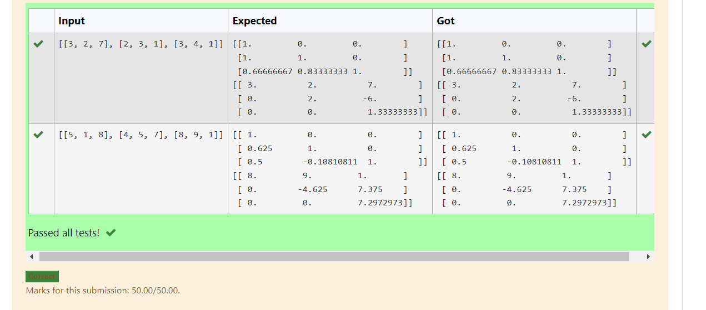
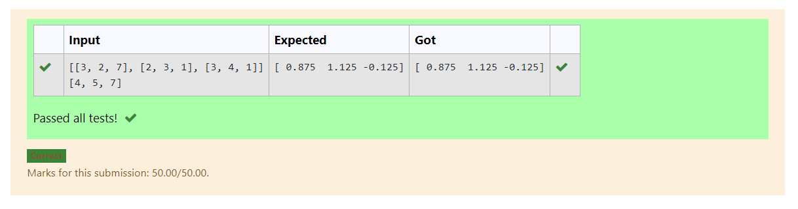

# LU Decomposition 

## AIM:
To write a program to find the LU Decomposition of a matrix.

## Equipments Required:
1. Hardware – PCs
2. Anaconda – Python 3.7 Installation / Moodle-Code Runner

## Algorithm
1. Write a python program.
2. Use numpy as np and open a special library named scipy.
3. Usinng eval data type get the input from the user.
4. Now complete the program and display the output and end the program.


## Program:
(i) To find the L and U matrix
```py
'''Program to find L and U matrix using LU decomposition.
Developed by:YUVASHAKTHI N C
RegisterNumber: 22008429
'''
import numpy as np
from scipy.linalg import lu
arr=eval(input())
A=np.array(arr)
P,L,U=lu(A)
print(L)
print(U)
```
(ii) To find the LU Decomposition of a matrix
```py
'''Program to solve a matrix using LU decomposition.
Developed by: YUVASHAKTHI N C
RegisterNumber: 22008429
'''

# To print X matrix (solution to the equations)
import numpy as np
from scipy.linalg import lu_factor,lu_solve
A=np.array(eval(input()))
B=eval(input())
res=lu_factor(A)
solution=lu_solve(res,B)
print(solution)

```

## Output:
 ## (i) To find the L and U matrix


 ## (ii) To find the LU Decomposition of a matrix
 


## Result:
Thus the program to find the LU Decomposition of a matrix is written and verified using python programming.

